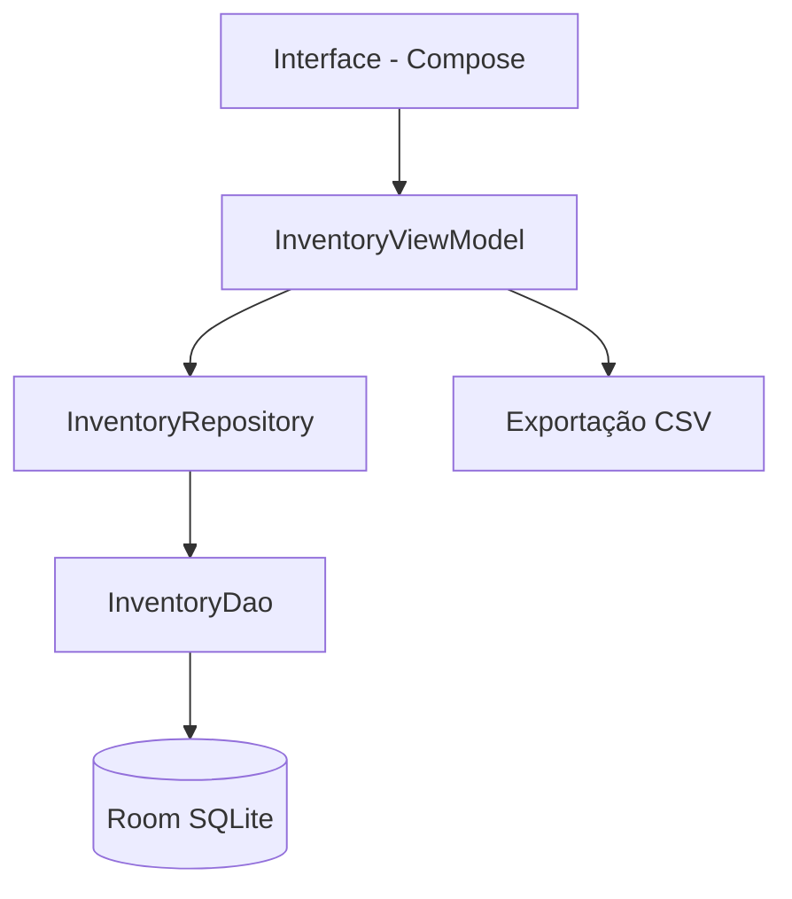
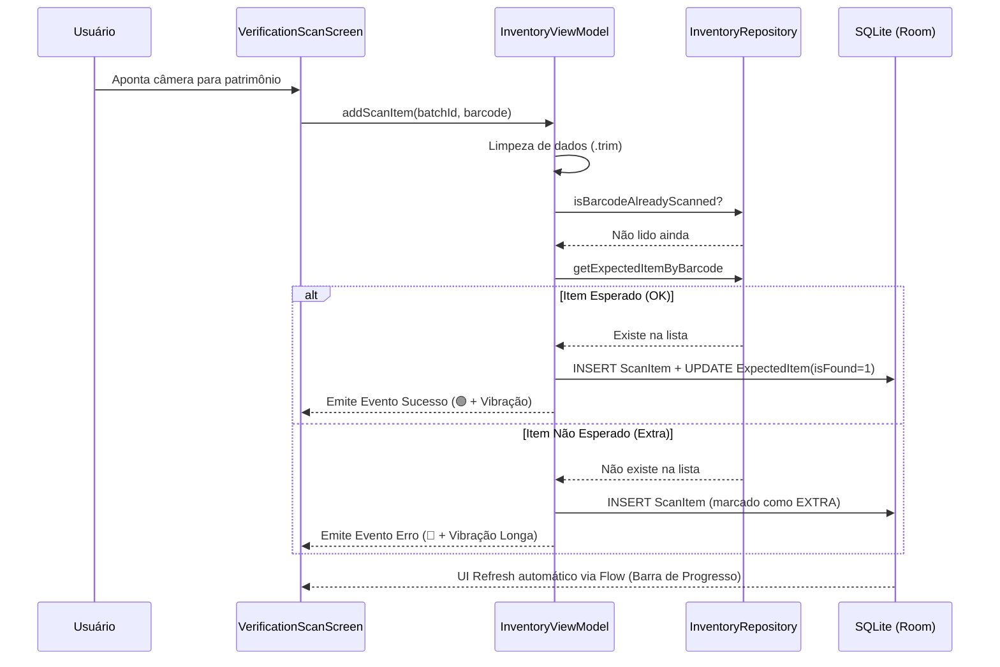
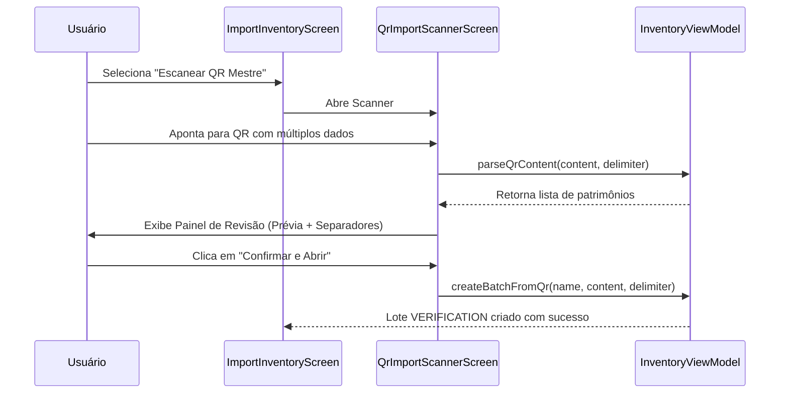
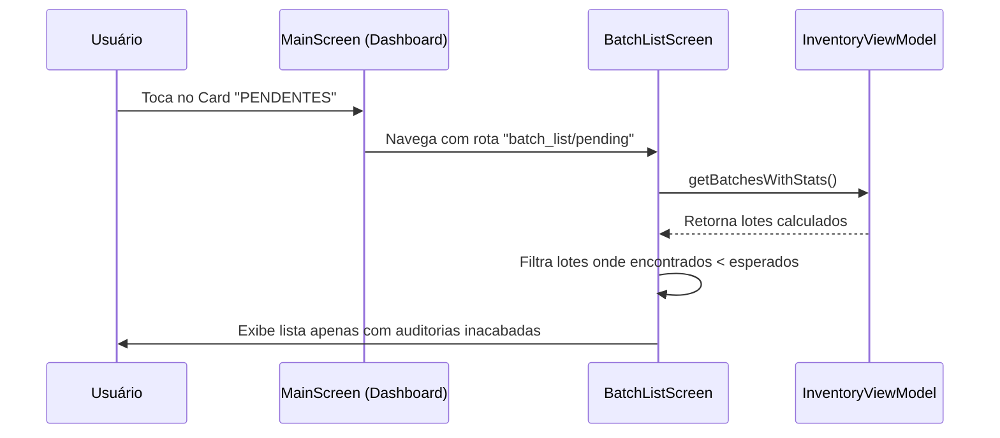
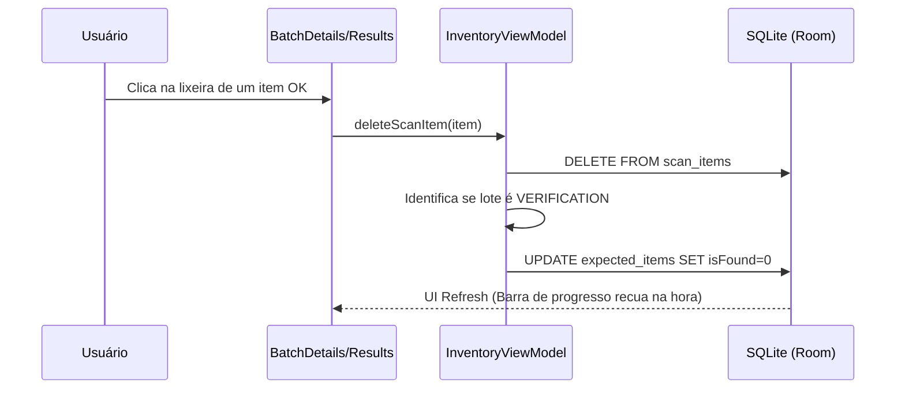
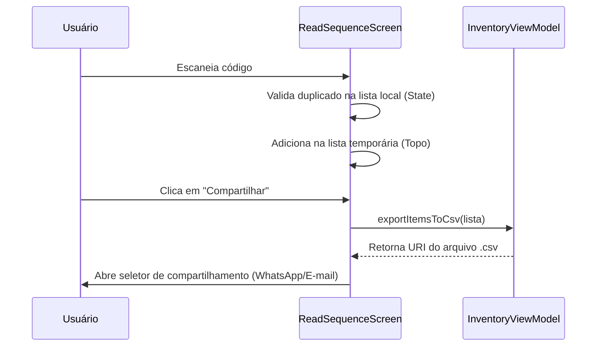
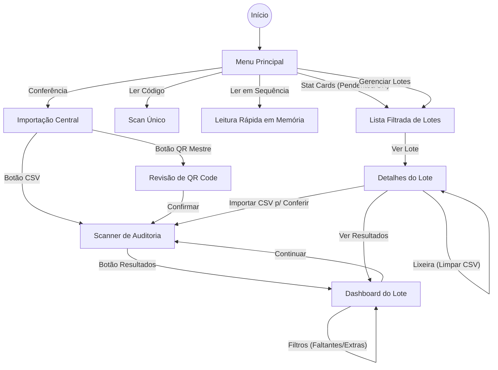

# Inventário & Auditoria Patrimonial

Aplicativo Android profissional para leitura de códigos (QR / Barcode) e gestão de ativos. Evoluiu de um simples leitor para um sistema completo de **Conferência Patrimonial**, permitindo auditorias baseadas em listas importadas, controle de pendências e exportação inteligente.

---

## 📑 Índice
- [Sobre](#sobre)
- [Principais Recursos](#principais-recursos)
- [Instalação / Execução](#instalação--execução)
- [Como Usar](#como-usar)
  - [Conferência Patrimonial (Auditoria)](#conferência-patrimonial-auditoria)
  - [Dashboard Inteligente](#dashboard-inteligente)
  - [Importação via QR Code Mestre](#importação-via-qr-code-mestre)
  - [Modos de Leitura](#modos-de-leitura)
- [Arquitetura](#arquitetura)
- [Descrição dos Componentes](#descrição-dos-componentes)
- [Mapa de Navegação](#mapa-de-navegação)
- [Otimização de APK](#otimização-de-apk)
- [Tecnologias](#tecnologias)
- [Licença](#licença)

---

## 📋 Sobre
O **Inventário** é um app robusto escrito em Kotlin que utiliza as tecnologias mais modernas do ecossistema Android (**Jetpack Compose, CameraX, Room**). Foi projetado para resolver dores reais de inventário empresarial, como a lentidão na coleta de dados, erros de duplicidade e a dificuldade em identificar itens faltantes em auditorias de campo.

---

## ✨ Principais Recursos
- **Dashboard Interativo**: Acompanhamento em tempo real de conferências concluídas e pendentes com atalhos inteligentes.
- **Auditoria Inteligente**: Importe uma lista de "Itens Esperados" e o app guiará a leitura, separando o que foi encontrado, o que falta e o que é excedente.
- **Importação Flexível**: Suporte a arquivos **CSV** e **QR Code Mestre** (lê uma lista inteira de um único QR).
- **Bloqueio de Duplicados**: Sistema inteligente que impede o registro repetido do mesmo código no mesmo lote.
- **Feedback Sensorial**: Vibrações e alertas visuais (Verde/Vermelho/Laranja) para indicar o status de cada leitura instantaneamente.
- **Exportação Segmentada**: Gere relatórios CSV focados apenas no que interessa (ex: exportar apenas a lista de itens faltantes).
- **APK Ultra-leve**: Otimizado de 77MB para **~4MB**, facilitando a instalação em qualquer dispositivo.

---

## 🚀 Instalação / Execução
Pré-requisitos:
- Android Studio (Hedgehog ou superior recomendado)
- JDK 11+
- Dispositivo Android (Android 10+ / API 29+) ou Emulador

### Comandos Úteis (Gradle):
- **Build Release (Otimizado)**: `./gradlew assembleRelease`
- **Instalar Debug**: `./gradlew installDebug`

---

## 🛠 Como Usar

### Conferência Patrimonial (Auditoria)
1. Acesse **Conferência Patrimonial** no menu.
2. Escolha um nome e importe sua lista mestra via CSV ou QR Code.
3. Inicie o scan: o app mostrará uma **barra de progresso**.
4. Use o **Resultado da Conferência** para ver exatamente o que falta e exportar relatórios de erro.

### Dashboard Inteligente
Os cartões no topo da tela inicial são clicáveis:
- **Pendentes**: Abre a lista focada apenas no que ainda não foi concluído.
- **Completas**: Mostra seu histórico de sucesso.
- **Patrimônios**: Total acumulado de leituras em todo o app.

### Importação via QR Code Mestre
Se você estiver no computador, selecione sua lista de patrimônios, gere um único QR Code (usando `;` ou nova linha como separador) e aponte o app. Ele fará o **parse automático**, mostrará uma prévia e criará o lote instantaneamente.

---

## 🏗 Arquitetura
O projeto segue o padrão **MVVM (Model-View-ViewModel)** com uma camada de dados reativa e repositório para abstração.

---

## 🔄 Fluxos Principais

### 1. Auditoria Patrimonial (Execução)
Este fluxo descreve como o app gerencia a inteligência de conferência ao salvar dados.

### 2. Importação via QR Code Mestre
O método mais rápido para carregar listas de conferência sem cabos ou e-mails.

### 3. Navegação Inteligente (Dashboard)
Atalhos baseados em status para ganho de produtividade.

### 4. Correção e Exclusão Sincronizada
Como o app mantém a integridade ao apagar uma leitura errada.

### 5. Leitura em Sequência (Não Persistente)
Ideal para conferências ultrarrápidas onde os dados não precisam de banco de dados.

---

## 📦 Descrição dos Componentes

- **Telas (Views)**:
  - `MainScreen`: Painel de controle e menu principal.
  - `VerificationScanScreen`: Scanner de auditoria com barra de progresso e feedbacks.
  - `AuditResultsScreen`: Visão detalhada de Esperados vs Encontrados com filtros.
  - `ImportInventoryScreen`: Central de importação (CSV/QR).
  - `BatchDetailsScreen`: Gestão de lotes, exclusão de itens e reversão de auditoria.
  - `ReadSequenceScreen`: Modo rápido em memória (não persistente).

- **Lógica (ViewModel)**:
  - Unificação de lógica: Qualquer leitura no app agora valida contra a lista de auditoria se o lote for de verificação.
  - Limpeza automática (`.trim()`) de códigos para evitar erros de espaços invisíveis.
  - Cálculo dinâmico de estatísticas de lotes (total, encontrados, faltantes).

---

## 🗺 Mapa de Navegação
O diagrama abaixo ilustra a hierarquia de telas e como o usuário se move entre os modos de operação.

---

## 📉 Otimização de APK
O app passou por uma redução drástica de tamanho para garantir performance e facilidade de distribuição:
1. **ML Kit Play Services**: O modelo de IA não é mais embutido, economizando ~30MB.
2. **Minificação (R8)**: Remoção automática de milhares de ícones não utilizados da biblioteca *extended*.
3. **ABI Filters**: APK focado em arquiteturas reais de smartphones.
4. **Resultado**: Redução de **77 MB** para **~4 MB**.

---

## 🧪 Tecnologias
- **Kotlin** — Linguagem moderna e segura.
- **Jetpack Compose** — UI declarativa de alta performance.
- **CameraX + ML Kit (Play Services)** — Leitura de códigos ultrarrápida.
- **Room Persistence** — Banco de dados local reativo.
- **Coroutines + Flow** — Processamento assíncrono sem travamentos.
- **Material Design 3** — Visual moderno e "Dark Mode" nativo.

---

## 🤝 Contribuição
Contribuições são o que tornam a comunidade de código aberto um lugar incrível para aprender, inspirar e criar. Qualquer contribuição que você fizer será **muito apreciada**.

1. Faça um Fork do projeto
2. Crie sua Feature Branch (`git checkout -b feature/IncrívelRecurso`)
3. Faça o Commit de suas alterações (`git commit -m 'Adicionado IncrívelRecurso'`)
4. Faça o Push para a Branch (`git push origin feature/IncrívelRecurso`)
5. Abra um Pull Request

---

## 📄 Licença
Este projeto está licenciado sob a **Licença MIT** — MIT © 2026 Edinho Grubert.
