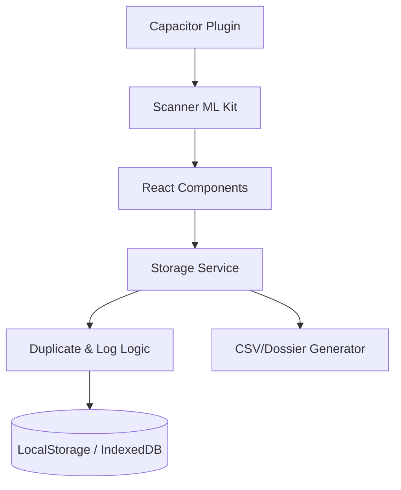

# AuditInventário - Auditoria & Gestão Patrimonial (v2.4 Enterprise)

O **AuditInventário** é uma solução híbrida (React + Capacitor) de alto desempenho para auditoria de ativos e gestão de inventário. Evoluiu de um simples leitor de códigos para um sistema completo de **Conferência Patrimonial**, oferecendo inteligência de dados, rastreabilidade total (Logs) e relatórios executivos prontos para tomada de decisão.

---

## 📑 Índice
- [Principais Recursos](#-principais-recursos)
- [Funcionalidades Enterprise (Novidade v2.4)](#-funcionalidades-enterprise-novidade-v24)
- [Tecnologias](#-tecnologias)
- [Instalação e Execução](#-instalação-e-execução)
- [Arquitetura](#-arquitetura)
- [Fluxos de Auditoria](#-fluxos-de-auditoria)
- [Licença](#-licença)

---

## ✨ Principais Recursos

- **Dashboard Executivo**: Acompanhamento em tempo real de acurácia, lotes pendentes e totais de patrimônios com design profissional.
- **Scanner Profissional (Google ML Kit)**: Leitura ultrarrápida de QR Codes e Códigos de Barras com bloqueio inteligente de duplicidade (1.5s delay) e estabilidade de hardware.
- **Importação Multimodal**:
  - **CSV/TXT**: Carga de listas mestre com 1 ou 3 colunas.
  - **QR Code Mestre**: Importação de listas inteiras via scan de um único código.
  - **Importação por Imagem**: Carregamento de QR Codes a partir da galeria de fotos.
- **Gestão de Lotes**: Criação de lotes para Coleta Simples (contagem rápida) ou Conferência (Auditoria vs. Lista Mestre).
- **Temas Dinâmicos**: Modo Claro (vibrante com gradientes) e Modo Escuro (executivo de alto contraste).

---

## 🏢 Funcionalidades Enterprise (Novidade v2.4)

O AuditInventário agora conta com recursos de nível corporativo para garantir a conformidade e segurança dos dados:

### 1. Sistema de Logs de Auditoria (Black Box)
Rastreabilidade total de cada ação no sistema. O app registra automaticamente:
- Tentativas de bipagens duplicadas (bloqueadas).
- Exclusões manuais de registros (quem, o quê e quando).
- Importações de listas e fechamento de lotes.
- *Acesso via botão "Histórico" em cada lote.*

### 2. Relatórios & Insights Avançados
Um painel analítico completo que oferece:
- **Análise de Risco**: Classificação automática da saúde do inventário (Baixo, Médio ou Elevado).
- **Estudo de Divergências**: Comparativo visual entre Itens Conciliados, Faltantes e Sobras (Excedentes).
- **Análise de Prefixos**: Identifica padrões de perdas agrupando patrimônios por prefixo de código.

### 3. Dossiê Executivo
Gerador de relatório em texto formatado contendo diagnóstico, indicadores e recomendações técnicas, pronto para ser copiado e enviado para atas de auditoria ou contabilidade.

### 4. Controle de Encerramento Seguro
Capacidade de **Finalizar** uma auditoria com registro de justificativa e **Reabrir** lotes para correções, mantendo a integridade do balanço final.

---

## 🧪 Tecnologias

- **React 18** + **TypeScript** — Lógica de interface moderna e robusta.
- **Capacitor 6** — Ponte nativa para acesso a recursos de hardware Android.
- **Google ML Kit** — Motor de visão computacional para escaneamento profissional.
- **Tailwind CSS** — Estilização baseada em utilitários para interface "Premium".
- **Lucide Icons** — Conjunto de ícones consistentes e leves.
- **Vite** — Tooling de build ultrarrápido.

---

## 🚀 Instalação e Execução

### Pré-requisitos:
- Node.js (v18 ou superior)
- Android Studio (Koala ou superior recomendado)
- Dispositivo Android (Android 10+) ou Emulador

### Passo a Passo:

1. **Clonar o Repositório**:
   ```bash
   git clone git@github.com:edinhogrubert/AuditoriaDePatrimonio.git
   cd AuditoriaDePatrimonio
   ```

2. **Instalar Dependências**:
   ```bash
   npm install
   ```

3. **Gerar Build Web**:
   ```bash
   npm run build
   ```

4. **Sincronizar com Android**:
   ```bash
   npx cap sync
   ```

5. **Executar no Dispositivo**:
   Abra o projeto no Android Studio e clique no **Play verde**.

---

## 🏗 Arquitetura

O projeto utiliza um modelo de **Serviço de Persistência Centralizado** para garantir que as regras de negócio (como bloqueio de duplicados e geração de logs) sejam aplicadas uniformemente em toda a aplicação.



---

## 📄 Licença

Este projeto está licenciado sob a **Licença MIT** — MIT © 2026 Edinho Grubert.
